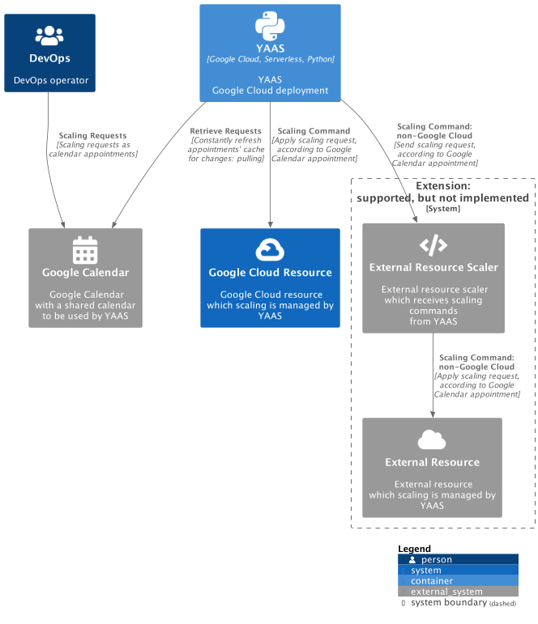
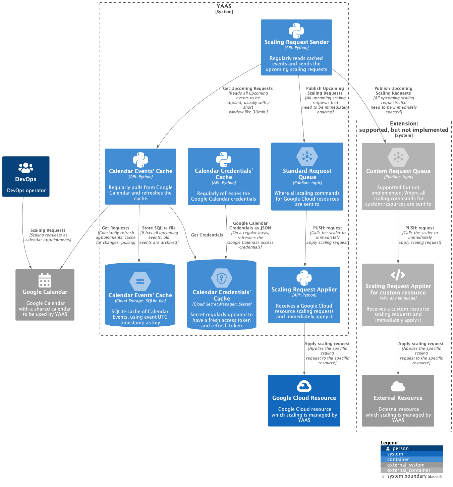
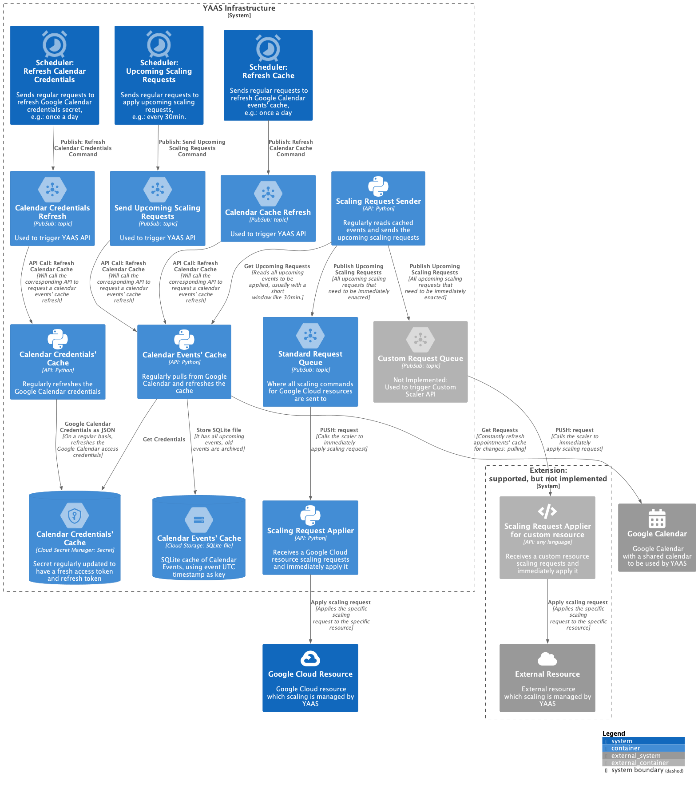

# YAAS Design

The below diagrams follows the [C4 model](https://c4model.com/) 
and used [PlantUML](https://plantuml.com/) for drawing them.

## System Context

[Source](./doc/diagrams/0_context.puml) ([PlantUML](https://plantuml.com/))

## Container

[Source](./doc/diagrams/1_container.puml) ([PlantUML](https://plantuml.com/))

## Components

[Source](./doc/diagrams/2_component.puml) ([PlantUML](https://plantuml.com/))

## High-Level Sequence Diagram

[Source](./doc/diagrams/YAAS%20-%20Sequence%20Diagram.txt) ([sequencediagram.org](https://sequencediagram.org/))

## References

* [C4 model](https://c4model.com/);
* [PlantUML](https://plantuml.com/);
* [sequencediagram.org](https://sequencediagram.org/).