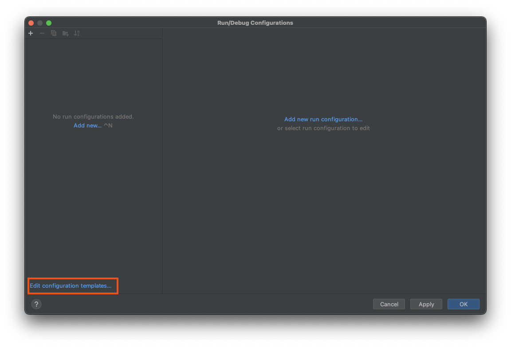
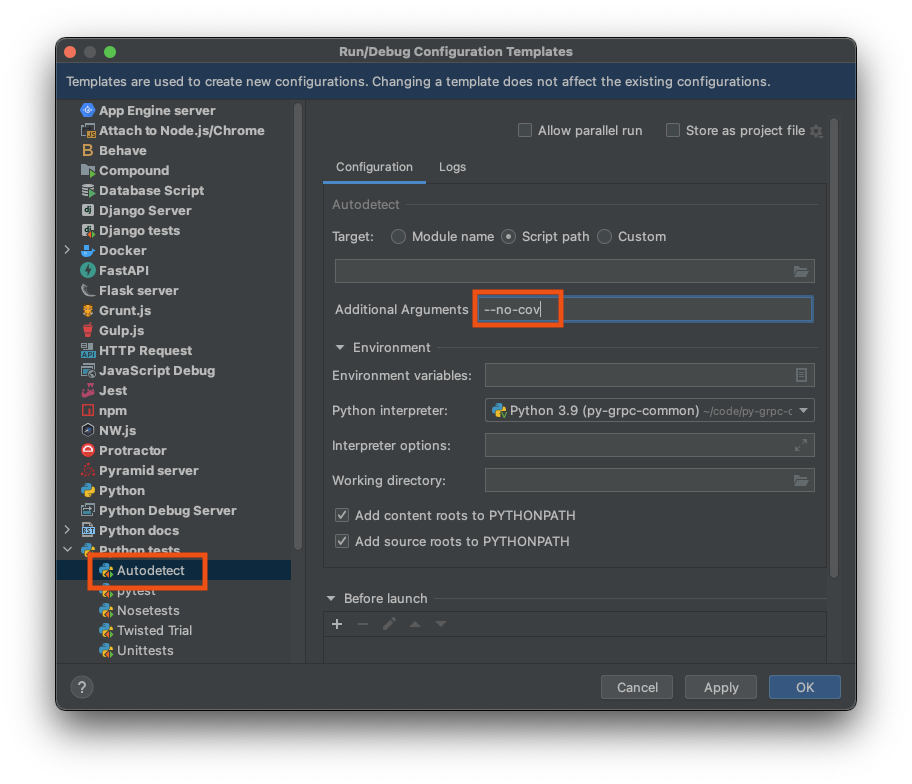

# Development

Below how to bootstrap your python environment, so it is sandboxed.

**NOTE:** Execute the below instructions inside the ``code`` dir:

```bash
cd code
```

## Development Environment Using Pyenv and Virtualenv

Install:

* (optional) [pyenv](https://github.com/pyenv/pyenv)
* [virtualenv](https://virtualenv.pypa.io/en/latest/)
* [poetry](https://python-poetry.org/)
* [jq](https://stedolan.github.io/jq/)
* [pre-commit](https://pre-commit.com/)
* [terraform](https://www.terraform.io/)
* [TFLint](https://github.com/terraform-linters/tflint)
* [tfsec](https://github.com/aquasecurity/tfsec)
* [terraform-docs](https://github.com/terraform-docs/terraform-docs)
* [checkov](https://www.checkov.io/)

### macOS

<details>
<summary>Click me</summary>

You need `Xcode`:

```bash
xcode-select --install
```

</details>

### (Optional) Pyenv

<details>
<summary>Click me</summary>

For macOS follow [https://gist.github.com/eliangcs/43a51f5c95dd9b848ddc](https://gist.github.com/eliangcs/43a51f5c95dd9b848ddc).
You might also need [https://github.com/jiansoung/issues-list/issues/13#issuecomment-478575934](https://github.com/jiansoung/issues-list/issues/13#issuecomment-478575934).

Set python 3.10 as default:

```basn
pyenv install 3.10.6
```

Set pyenv defaults:
```bash
pyenv global 3.10.6
pyenv local 3.10.6
```

</details>

### Virtualenv

Install Virtualenv and update `pip`:

```bash
pip3 install -U pip virtualenv poetry pre-commit checkov
```

Create virtualenv:

```bash
virtualenv -p python3 -q .venv
```

To activate your python virtualenv:

```bash
. .venv/bin/activate
```

Validate with:

```bash
python --version
python3 --version
```

Expected:

```text
Python 3.10.6
Python 3.10.6
```

Install packages:

```bash
pip3 install -U pip wheel setuptools poetry pre-commit checkov
```

## Install ``pre-commit`` (only once)

<details>
<summary>Click me</summary>

```bash
pre-commit install
```

### ``pre-commit`` Basics

Check all files:

```bash
pre-commit run --all-files
```

Only check ``code``:

```bash
git ls-files -- code | xargs pre-commit run --files
```

Only check ``terraform``:

```bash
git ls-files -- terraform | xargs pre-commit run --files
```

</details>

## Poetry Basics

<details>
<summary>Click me</summary>

In each of the folders in ``code``:

Install dependencies:

```bash
poetry install
```

Run tests:

```bash
poetry run pytest
```

Run linter:

```bash
poetry run pylint src tests
```

Run formatter:

```bash
poetry run black src tests
```

Build wheel file:

```bash
poetry build
```

</details>

# Building Assets

## Build Docker Image

<details>
<summary>Click me</summary>

Create main ``dist`` folder:

```bash
mkdir -p ./code/dist

unset PKGS
PKGS=("core" "cli" "service")
for P in ${PKGS[@]}; do
  echo "Creating wheel for <${P}>"
  pushd ./code/${P}
  poetry build
  cp ./dist/*.whl ../dist/
  popd
done
```

Scheduler:

```bash
docker build \
  --build-arg DIST_DIR="./code/dist" \
  --build-arg PY_PACKAGE="yaas_scheduler_service" \
  --tag yaas-scheduler \
  --file ./docker/Dockerfile \
  .
```

Scaler:

```bash
docker build \
  --build-arg DIST_DIR="./code/dist" \
  --build-arg PY_PACKAGE="yaas_scaler_service" \
  --tag yaas-scaler \
  --file ./docker/Dockerfile \
  .
```

### Test Docker Image Locally

If you follow standard terraform code:

```bash
PROJECT_ID=$(gcloud config get-value core/project)
PROJECT_NUMBER=$(gcloud projects describe ${PROJECT_ID} --format="value(projectNumber)")

export CONFIG_BUCKET_NAME="yaas-app-${PROJECT_NUMBER}"
export CONFIG_OBJECT_PATH="yaas/config.json"
```

Or set it manually:

```bash
export CONFIG_BUCKET_NAME="BUCKET_NAME"
export CONFIG_OBJECT_PATH="path/to/config.json"
```

Start image:

```bash
PORT=8080

docker run \
  --publish 127.0.0.1:${PORT}:${PORT} \
  --volume "${HOME}/.config/gcloud/application_default_credentials.json":/gcp/creds.json:ro \
  --env GOOGLE_CLOUD_PROJECT=${PROJECT_ID} \
  --env GOOGLE_APPLICATION_CREDENTIALS=/gcp/creds.json \
  --env PORT=${PORT} \
  --env CONFIG_BUCKET_NAME=${CONFIG_BUCKET_NAME} \
  --env CONFIG_OBJECT_PATH=${CONFIG_OBJECT_PATH} \
  -it yaas-scaler
```

Test the image:

```bash
curl http://localhost:8080/config
```

</details>

# PyCharm Users

<details>
<summary>Click me</summary>

Setup your [Poetry](https://www.jetbrains.com/help/pycharm/poetry.html) environment.

You need to add ``--no-cov`` to your `Run/Debug` settings.
Below are the instructions on how to do it.
Tested with `PyCharm 2022.2.1 (Professional Edition)` for macOS.

### Menu `Run` click on `Edit Configurations...`:


### Click `Edit configuration templates...`



### Select `Python tests/Autodetect`

Add `--no-cov` to `Additional Arguments` field:



### Select `Python tests/pytest`

Add `--no-cov` to `Additional Arguments` field:


</details>
