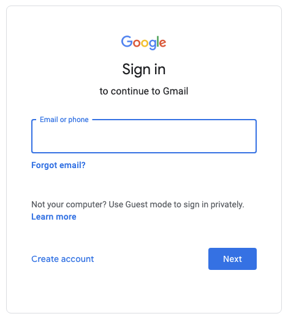
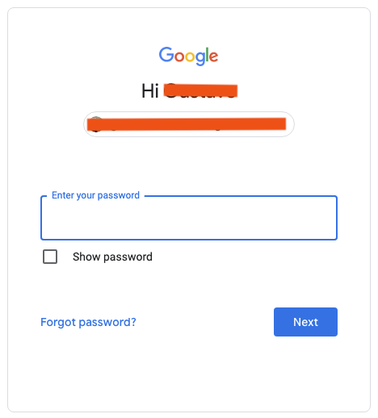
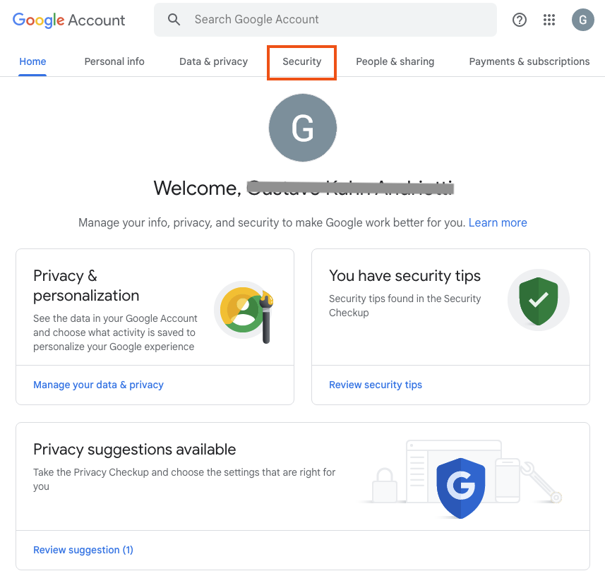
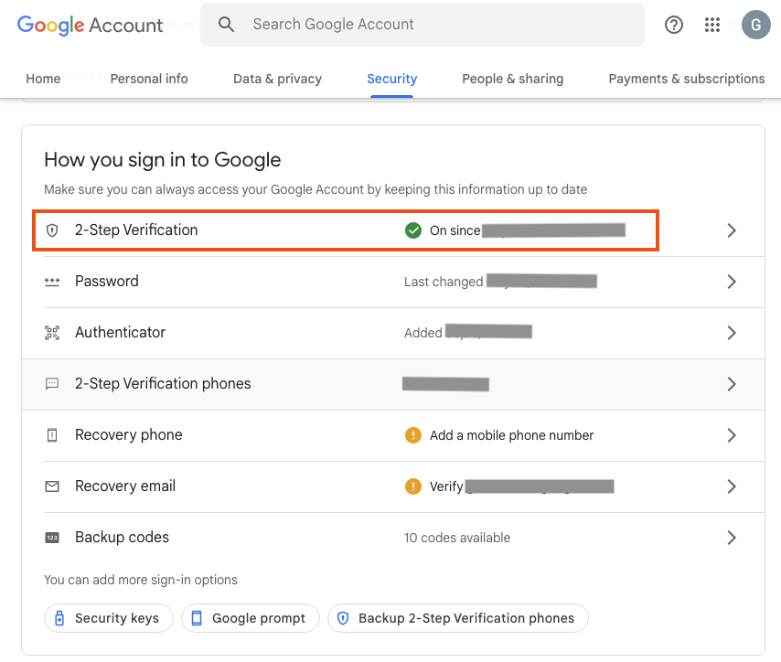
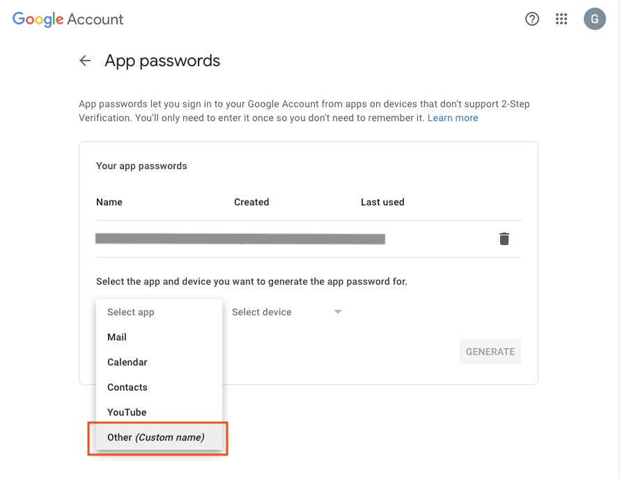
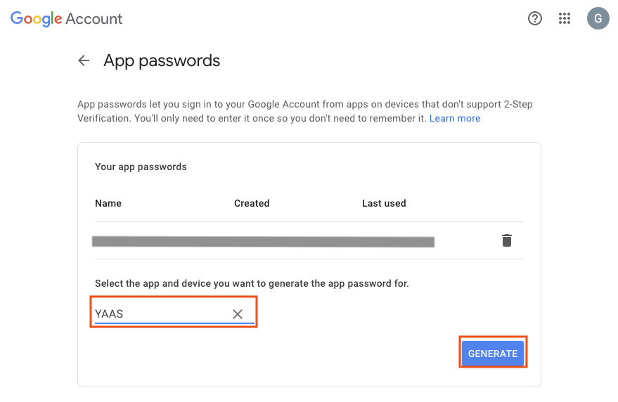
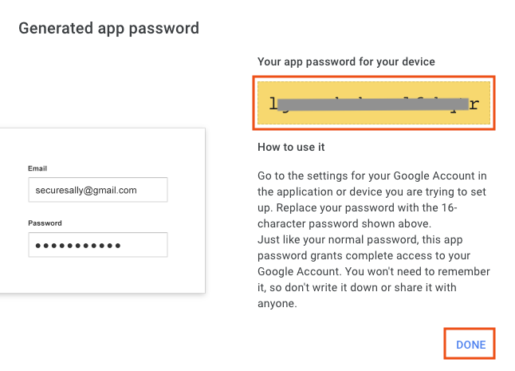

# Specific documentation on Google Calendar using [CalDAV](https://en.wikipedia.org/wiki/CalDAV)

If you landed here, you will grant access to your calendar using the [CalDAV](https://en.wikipedia.org/wiki/CalDAV).

## Before We Start

We assume you have a working [Gmail](https://en.wikipedia.org/wiki/Gmail) account (if you don't follow instructions [here](https://support.google.com/mail/answer/56256?hl=en)).

## Get Google Application Password

You need to get your application password for your Gmail account.
For this we will follow [this](https://support.google.com/accounts/answer/185833?hl=en).
The step-by-step below:

### Login into your Gmail account

1. Go to [https://mail.google.com/](https://mail.google.com/).
2. Put in your credentials (if not yet).

#### Visually
<details>
<summary>Click me</summary>

Your email:



Password:



</details>

### Create Application Password

1. Go to [Account Settings](https://myaccount.google.com/).
1. Select ``Security`` in the ribbon.
1. Check that you have ``2-Step Verification`` enabled in ``How you sign in to Google``.
1. If you do (highly recommended), you need to create an ``App Password``.
   1. Go to [App Passwords](https://myaccount.google.com/apppasswords).
   1. Select app: ``Other (Custom name)``
   1. Name: ``YAAS``
   1. Click ``GENERATE``
   1. Save the content of ``Your app password for your device`` in the secret.
1. If you do **NOT** have ``2-Step Verification``, the content of the secret is your password.

#### Visually
<details>
<summary>Click me</summary>

Account settings:



Check if ``2-Step Verification`` is enabled



Create a custom App Passowrd:



Generate the password:



Get the password:



</details>

### Set your environment variables

```bash
export GMAIL_USERNAME="YOUR_EMAIL@gmail.com"
```
