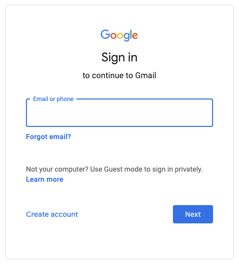
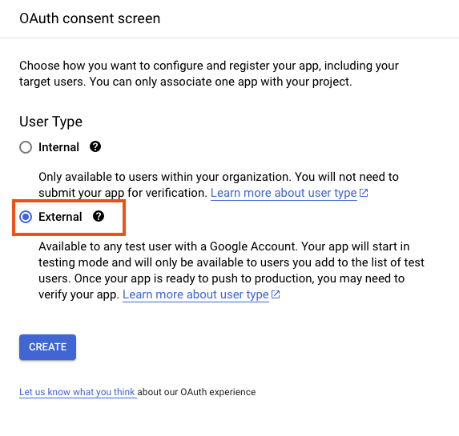
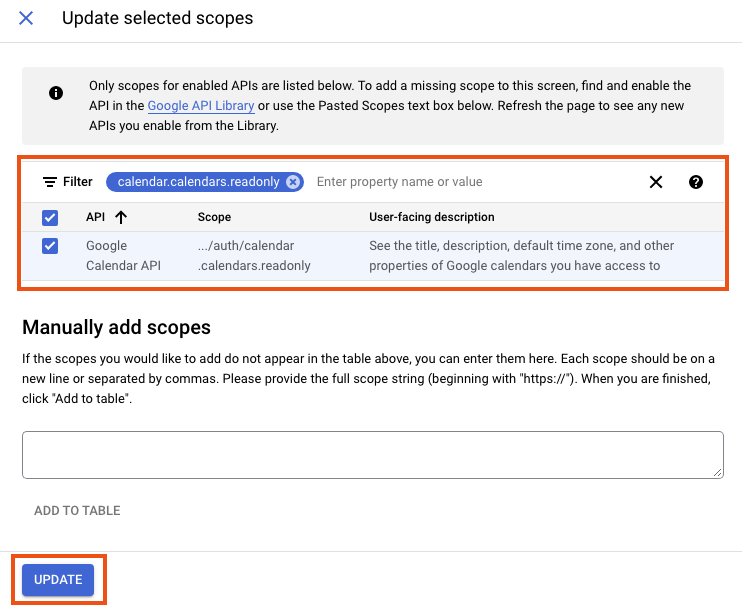
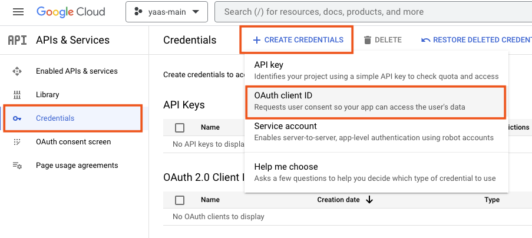

# Specific documentation on [Google Calendar API](https://developers.google.com/calendar/api/guides/overview)

If you landed here, you will grant access to your calendar using the [Google Calendar API](https://developers.google.com/calendar/api/guides/overview).

## Before We Start

We assume you have a working [Gmail](https://en.wikipedia.org/wiki/Gmail) account (if you don't follow instructions [here](https://support.google.com/mail/answer/56256?hl=en)).

## Get Google Calendar API Initial Credentials

You need to get your application initial credentials.
For this we will to [create an OAuth credentials](https://developers.google.com/calendar/api/quickstart/python).
The step-by-step below:

### Login into your Gmail account

1. Go to [https://mail.google.com/](https://mail.google.com/).
2. Put in your credentials (if not yet).

#### Visually
<details>
<summary>Click me</summary>

Your email:



Password:


</details>

### Consent Screen

1. Go to [APIs & Services](https://console.cloud.google.com/apis/dashboard).
1. (If first time) Create an [OAuth consent screen](https://console.cloud.google.com/apis/credentials/consent):
    - User type: ``External``.
    - Name: ``yaas`` (you can pick a different one).
    - Scopes: ``calendar.calendars.readonly``.
    - Test users: ``<YOUR GMAIL ACCOUNT EMAIL>``.

#### Visually
<details>
<summary>Click me</summary>

User type:



App info:


Set scope:




</details>


### OAuth Credentials

1. Go to [APIs & Services](https://console.cloud.google.com/apis/dashboard).
1. Select [Credentials](https://console.cloud.google.com/apis/credentials).
1. Click on ``Create Credentials``.
1. Select ``OAuth client ID`` on the drop-down.
1. The information is:
   - Name: ``yaas-calendar-client`` (you can pick a different one).
   - Type: ``Desktop app``.
1. Download the JSON file corresponding to the credentials.
   - It is assumed you saved the file under ``${HOME}/calendar-api-initial.json``.

#### [Disclaimer On Authorization Token](./OAUTH.md)

#### Visually

<details>
<summary>Click me</summary>

Create:



Type ``Desktop app``:


Full form:


Download:


List of clients:


</details>

### Set your environment variables

```bash
export INITIAL_CREDENTIALS_JSON="${HOME}/calendar-api-initial.json"
```
