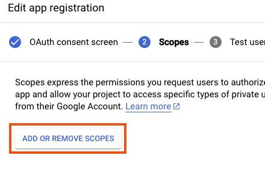

# How To Deploy/Install YAAS End-To-End

If you landed here, you either you want to try it out or are ready to deploy.
Let us get to it.

## Before We Start

Below is a list of things you should have **before** you start:
1. [Google Cloud project to deploy YAAS](https://cloud.google.com/resource-manager/docs/creating-managing-projects);
1. [A Google account with Calendar that you are going to use with YAAS](https://support.google.com/mail/answer/56256?hl=en);
1. [Terraform CLI](https://developer.hashicorp.com/terraform/downloads) (tested with `v1.3.7`);
1. [Google Cloud SDK](https://cloud.google.com/sdk) (tested with `v416.0.0`);
1. [Python 3](https://www.python.org/downloads/) (tested with `3.10.8`);
1. [Bash compatible shell](https://www.gnu.org/software/bash/) (tested with `v3.2.57`);
1. [Git](https://git-scm.com/) (tested with `v2.39.2`);
1. [jq](https://stedolan.github.io/jq/) (tested with `v1.6`).

## Authenticate to Google Cloud

```bash
gcloud auth application-default login
```

### Set default project

```bash
gcloud init
```

## Definitions

Manually set:

```bash
export PROJECT_ID=$(gcloud config get-value core/project)
export REGION="europe-west3"
```

Check:

```bash
echo "Main project: ${PROJECT_ID}@${REGION}"
```

## Terraform [Bootstrap](./terraform/README.md#bootstrap) ONLY

**NOTE:** You should need this only once.

```bash
export TF_DIR="./terraform/bootstrap"
```

```bash
terraform -chdir=${TF_DIR} init -upgrade
```

### Plan

```bash
TMP=$(mktemp)
terraform -chdir=${TF_DIR} plan \
  -out ${TMP} \
  -var "project_id=${PROJECT_ID}" \
  -var "region=${REGION}"
```

### Apply

```bash
terraform -chdir=${TF_DIR} apply ${TMP} && rm -f ${TMP}
```

**NOTE:** There are other steps after this, but we can interrupt here.

## Get Google Calendar API Initial Credentials

You need to get your application initial credentials.
For this we will to [create an OAuth credentials](https://developers.google.com/calendar/api/quickstart/python).
The step-by-step below:

### Consent Screen

1. Go to [APIs & Services](https://console.cloud.google.com/apis/dashboard);
1. (If first time) Create an [OAuth consent screen](https://console.cloud.google.com/apis/credentials/consent):
    - User type: ``External``;
    - Name: ``yaas`` (you can pick a different one);
    - Scopes: ``calendar.calendars.readonly``;
    - Test users: ``<YOUR GMAIL ACCOUNT EMAIL>``.

#### Visually
<details>
<summary>Click me</summary>

User type:


App info:


Set scope:




</details>


### OAuth Credentials

1. Go to [APIs & Services](https://console.cloud.google.com/apis/dashboard);
1. Select [Credentials](https://console.cloud.google.com/apis/credentials);
1. Click on ``Create Credentials``;
1. The information is:
   - Name: ``yaas-calendar-client`` (you can pick a different one);
   - Type: ``Desktop app``;
1. Download the JSON file corresponding to the credentials.
   - It is assumed you saved the file under ``${HOME}/calendar-api-initial.json``

#### [Disclaimer On Authorization Token](./OAUTH.md)

#### Visually

<details>
<summary>Click me</summary>

Create:


Type ``Desktop app``:


Full form:


Download:


List of clients:


</details>

## Enable Your Github Repository (if needed)

In case you are not using the public repository and you are using a private Github fork.
We recommend you have your own fork so that you can evaluate if you want the changes in the public repo.

### Google Cloud Build

You need to enable Cloud Build to access your Github repo.

1. Go to [Cloud Build](https://console.cloud.google.com/cloud-build/builds);
1. Start creating a trigger (you will not actually do it manually) in [Triggers](https://console.cloud.google.com/cloud-build/triggers);
1. Select the **correct** region for you;
1. Click ``Connect Repository``;
1. Select ``Github`` as Source and click ``Continue``;
1. (In a separate window) You should authenticate with your Github credentials;
1. Select the appropriate repo;
1. When you reach the step ``Create a trigger``, ignored it by clicking ``Done``;

#### Visually
<details>
<summary>Click me</summary>

Region in ``Triggers``:


Click ``Connect Repository``:


Select ``Github``:


Authenticate at ``Github``:


Select a repo:


Done:


</details>

## Google Calendar For YAAS

### Create a Specific Calendar for YAAS

You should create [new calendar](https://support.google.com/calendar/answer/37095?hl=en).
We assume it is called ``YAAS Scaling``, but the name is not important.
The name is only relevant to make sense of the instructions.

The relevant part is to get the calendar ID.
To get it from the [Google Calendar Web UI](https://calendar.google.com/calendar):

1. Hover over your calendar name;
1. Click the _tripple dot_ menu;
1. Go to ``Settings and sharing``;
1. Go to section ``Integrate calendar``;
1. You should find the ID under ``Calendar ID``;

The ID follows the pattern: ``<some large hexdecimal value>@group.calendar.google.com``

#### Visually

<details>
<summary>Click me</summary>

_Tripple dot_ menu:


Calendar ID:


</details>

## Resume Deployment

At this point you have the following:

- You Calendar ID;
- The initial credentials to access your Calendar via Google Cloud;
- You have your own Github repo and you have it checked out right here.

To make it easier:

Calendar ID:

```bash
export CALENDAR_ID="YOUR_GOOGLE_CALENDAR_ID"
```

Github info:

```bash
export GITHUB_REPO=$(basename `git rev-parse --show-toplevel`)
export GIT_BRANCH=$(git rev-parse --abbrev-ref HEAD)
```

### [Continue Deployment](./terraform/README.md#bootstrap)

First, finishe defining the missing bits in [Definitions](./terraform/README.md#definitions).

Please go to ``terraform`` directory and redo [bootstrap](./terraform/README.md#bootstrap),
but this time continue until finished.

```bash
cd terraform
```

## Add Proper Calendar Credentials

This is needed because the initial JSON credentials does not have the user (your Gmail account) authorization.
Here we will go through it.

### Install The Code Locally

You need to go through the instructions in [DEVELOPMENT.md](./DEVELOPMENT.md) but feel free to skip the [Building Assets](./DEVELOPMENT.md#building-assets) section.
Once you are finished setting up your python environment, you can go to [CLI.md](./code/cli/CLI.md#refreshreset-calendar-credentials), section ``Refresh/Reset Calendar Credentials``.
For the secret name, use:

Find secret:

```bash
export SECRET_FULL_NAME=$(gcloud secrets list \
  --project=${PROJECT_ID} \
  --format=json \
  | jq -c -r ".[].name" \
  | grep yaas\
)
echo "Found secret: <${SECRET_FULL_NAME}>"
```

As stated in [OAuth Credentials](#oauth-credentials):

```bash
export INITIAL_CREDENTIALS_JSON="${HOME}/calendar-api-initial.json"
```
