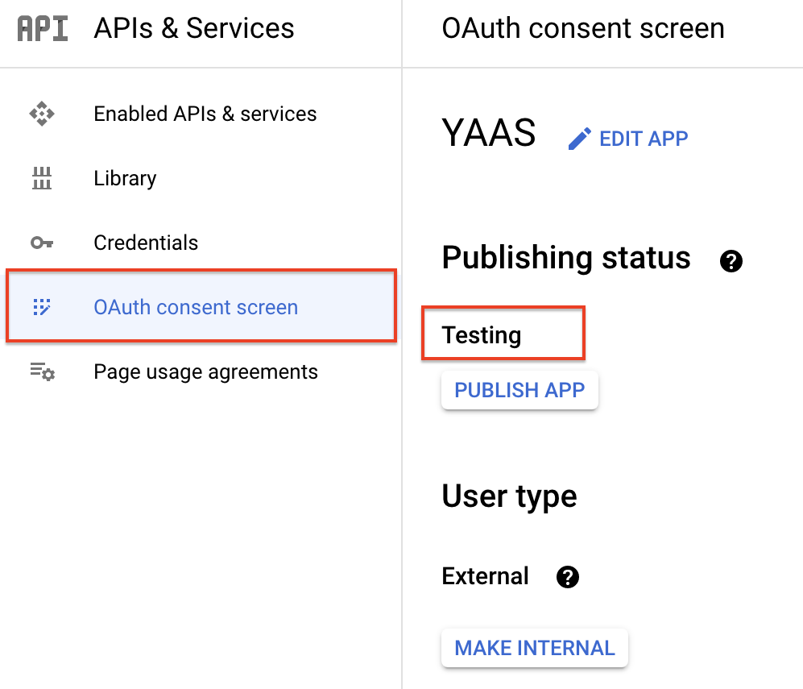

# Disclaimer On Authorization Token

If you are still using the testing scope be aware that you will need to recreate the Google Calendar authorization token procedure every 7 days.
This is the procedure in [CLI.md](./code/cli/CLI.md)
For more information read the section [Refresh token expiration](https://developers.google.com/identity/protocols/oauth2#expiration) in the [Google Identity](https://developers.google.com/identity) documentation on [OAuth 2.0](https://developers.google.com/identity/protocols/oauth2).

## Check the setup

Check current state:

1. Go to [APIs & Services](https://console.cloud.google.com/apis/dashboard).
1. Select [OAuth consent screen](https://console.cloud.google.com/apis/credentials/consent) on the left pane.
1. Check ``Publishing status``, if it says ``Testing`` it means you are restricted to the 7 days cap.

### Visually

Click me

## Alternatives

We recommend using [Google Workspace](https://workspace.google.com/) and changing the user type to internal - clicking the button ``MAKE INTERNAL``.
This will mean that you need to create an account in your organization for the YAAS calendar.

The other option is to publish your YAAS App version. We do **NOT** recommend it for security issues.
We have neither designed nor tested for an adversarial environment, i.e., the Internet as whole.
You would also need to go the route of getting your application approved by Google.
