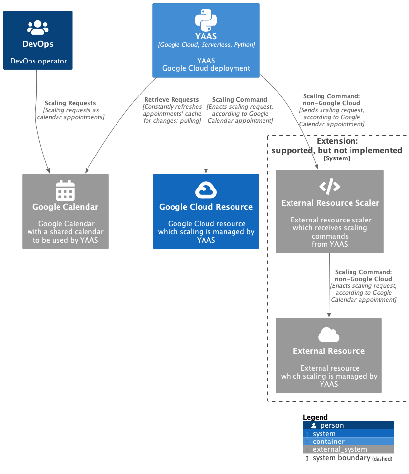
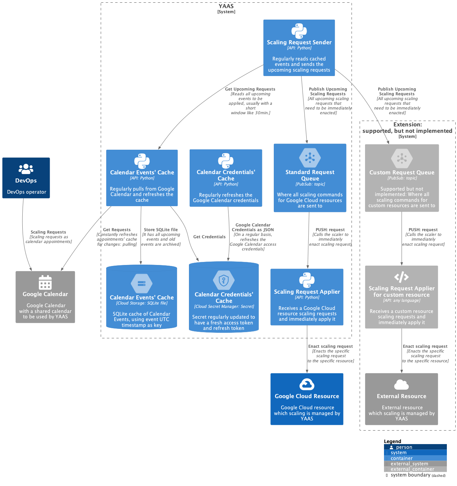

# YAAS Design

The below diagrams follows the [C4 model](https://c4model.com/) 
and used [PlantUML](https://plantuml.com/) for drawing them.

## System Context

[PlantUML](https://plantuml.com/) [Source](./diagrams/0_context.puml)

## Container

[PlantUML](https://plantuml.com/) [Source](./diagrams/1_container.puml)

## Components

[PlantUML](https://plantuml.com/) [Source](./diagrams/2_component.puml)

## References

* [C4 model](https://c4model.com/);
* [PlantUML](https://plantuml.com/).